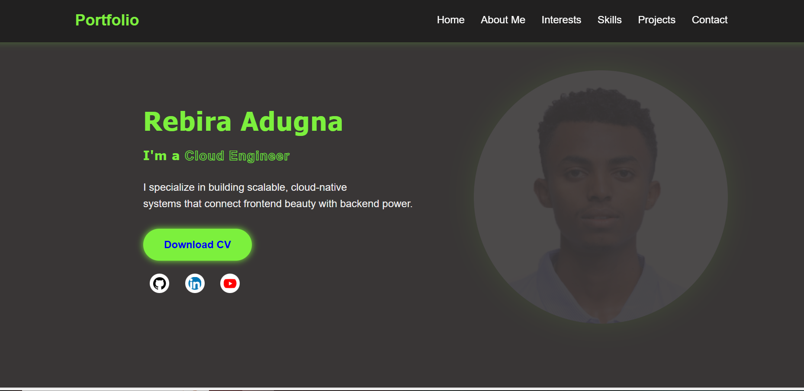
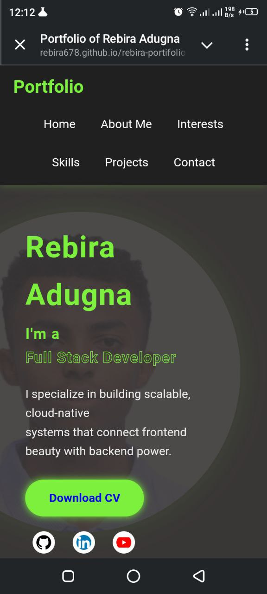

# Personal Portfolio — Rebira Adugna

Welcome to my personal portfolio :a fully responsive and visually clean website built entirely with **pure HTML and CSS** (no frameworks or JavaScript).

This portfolio was created as part of a challenge with 7,000 participants, and it showcases my creativity, layout skills, and mobile-first development approach using only core web technologies.

---

## ✨ Features

- ✅ 100% Pure HTML & CSS (No JS, No Frameworks)
- ✅ Mobile-Friendly Navigation Bar (Responsive Hamburger Menu)
- ✅ Minimalist Design with Professional Aesthetic
- ✅ Sectioned Layout:
  - Home
  - About
  - Skills
  - Projects
  - Contact

---

## 📱 Mobile First Design

Mobile Navigation Fix
To make the navigation menu responsive on mobile without JavaScript or libraries, I used CSS media queries. The navbar switches to a horizontal, wrapped layout on screens 768px and below. Menu items display inline-block with adjusted spacing, ensuring all links fit neatly on one line or wrap smoothly. This pure CSS solution provides a simple, lightweight, and fully accessible mobile navigation experience.

---

## 📸 Screenshots

| Desktop View                              | Mobile View |
|--------------                             |-------------|
|  |  |


---

## 📁 Project Structure

```bash
├── index.html
├── style.css
├── images/
│   └── project.png
|   └── rebik.jpg
|   ........
└── README.md
```

---

## 🚀 How to Run
see live 
  https://rebira678.github.io/rebira-portifolio/

  Or

1. Clone this repo or download the ZIP:
   ```bash
   git clone https://github.com/rebira678/portfolio-challenge.git
   ```
2. Open `index.html` in any browser.
3. Done! No dependencies needed.

---
